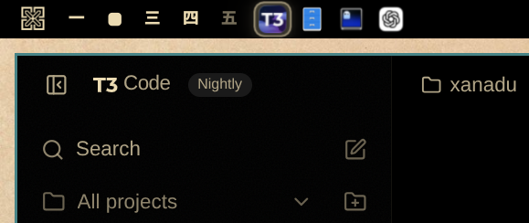

# Workspace Window Icons for Omarchy

A native Omarchy/Quickshell task strip for Hyprland scrolling workspaces. It
shows every window in the focused workspace as an application icon, including
windows outside the visible scrolling viewport.



## Features

- Shows only windows from the focused workspace.
- Follows the compositor's left-to-right window geometry rather than focus history.
- Updates icon order after in-layout window swaps, including swaps for which
  Hyprland emits no window-move event.
- Keeps off-screen scrolling-layout windows visible in the bar.
- Places tiled windows first and floating windows afterward.
- Uses clean, full-opacity application icons with no idle tiles or underlines.
- Marks the focused window with a rounded, theme-aware raised surface.
- Left-clicks focus windows, middle-clicks close them, and tooltips show titles.
- Resolves icons for native apps, Electron apps, Flatpaks, wrapped terminal
  applications, Wine/Lutris games, Steam games, and Chromium-family web apps.
- Uses each Omarchy web app's installed favicon instead of the shared browser icon.
- Distinguishes native Quickshell plugin windows that share the same process and
  window class, using plugin manifests, launcher aliases, and local icon assets.
- Matches Steam games by AppID and uses Steam's installed game icon or local
  library cache instead of the generic Steam icon.
- Adapts to top, bottom, left, and right bars, including scaled displays.

## Install

```bash
omarchy plugin add https://github.com/gavinanelson/omarchy-workspace-window-icons --enable
```

That's it. Omarchy handles validation, enabling, and bar placement.

## Appearance settings

Right-click any window icon to adjust:

- icon saturation;
- icon size;
- unfocused icon opacity;
- spacing between icons.

The defaults use original icon colors at full opacity. Unfocused icons have no
background decoration; only the focused window receives a selection surface.

## Requirements

- Omarchy with its Quickshell-based shell.
- Hyprland.
- Standard Freedesktop desktop entries for application icon matching.

There are no extra packages, daemons, or runtime network calls. Window state
comes from Quickshell's Hyprland integration, with a lightweight local
`hyprctl clients` snapshot keeping spatial order current when Hyprland omits a
layout-reorder event. One-shot process lookups read `/proc/<pid>/exe` and the
Steam AppID environment variables to identify wrapped applications. Web-app
icons come from the local desktop entries and icon files that Omarchy creates
when installing a web app.
Quickshell plugin windows use the shell's live plugin registry; launcher icons
remain authoritative when a matching desktop entry exists, with plugin-local
icon assets as the fallback.

The widget has no application-specific class list or monitor coordinates. It
uses each system's Freedesktop desktop entries, focused Hyprland workspace, and
live compositor geometry, so it works with custom themes, multiple monitors,
standard Hyprland layouts, and scrolling layouts. Web-app matching uses generic
URL hosts and installed PWA IDs rather than an application-specific allowlist.

## Icon resolution

The widget follows one deterministic pipeline:

1. Match stable platform identity: Steam AppID, web-app URL/app ID, or
   Quickshell plugin manifest.
2. Match the window class, initial class, and executable against Freedesktop
   desktop-entry IDs, `StartupWMClass`, and every command token.
3. Match the exact window title to the desktop-entry name only when stronger
   identifiers did not resolve it.
4. Render through Omarchy's shared launcher icon index and icon-theme lookup.
5. Fall back to a plugin-local asset, Steam's local library icon, then the
   system's generic application icon.

This covers applications installed by Omarchy as well as standard native,
Flatpak, AppImage, Wine/Proton, Steam, Electron, browser-app, terminal-wrapper,
and Quickshell packaging conventions without per-application rules.

## Remove

```bash
omarchy plugin remove
```

Choose **Workspace Window Icons** from the list.

## Development

From the repository root, run:

```bash
omarchy plugin validate .
./tests/test_plugin.sh
```

## Attribution

Icon matching and the initial bar-widget structure were adapted from Carmine
Paolino's MIT-licensed
[crmne Active Window](https://github.com/crmne/omarchy-active-window). The
workspace model, geometry ordering, multi-window interaction, focused-state
design, settings, and packaging were developed for this plugin.

## License

MIT. See [LICENSE](LICENSE).
